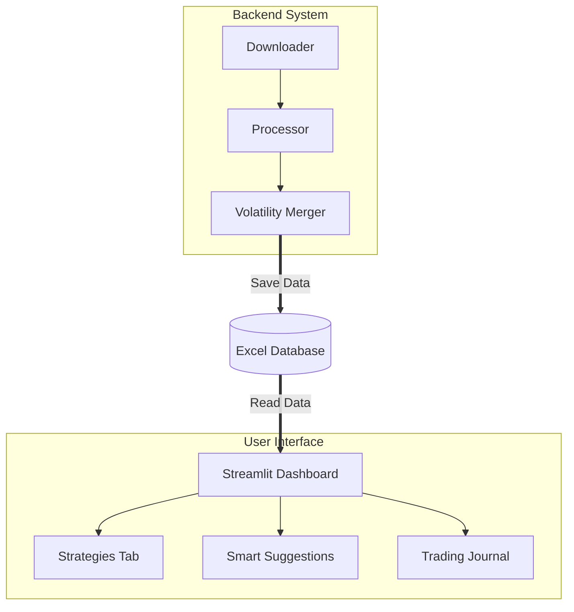

# TSE Option Dashboard


This project is an advanced analytics dashboard for the Tehran Stock Exchange (TSETMC) Options market, developed to automate data extraction and identify trading opportunities based on volatility.

The system operates in real-time (updating every 3 minutes), connecting to the market core to process data, calculate Greeks and Historical Volatility, and visualize profitable strategies.

---

## Key Features

### 1. Full Automation
* Background automated data fetching from TSETMC.
* Multi-threaded architecture to ensure the dashboard remains responsive during updates.
* Automatic calculation of Historical Volatility (HV) for underlying assets.

### 2. Strategy Analyzer
Calculates P&L and plots payoff diagrams for advanced strategies:
* **Volatility Strategies:** Straddle, Strangle, Strap, Strip.
* **Directional Strategies:** Bull Call Spread, Bear Call Spread.
* Visual representation of Breakeven points and Max Profit/Loss.

### 3. Smart Suggestions
* Scans the entire market to identify assets with suitable volatility for Long/Short strategies.
* Filters out illiquid contracts to ensure execution quality.

### 4. Trading Journal
* Built-in tool to log and track executed trades.
* Generates specific payoff diagrams for recorded positions.

---

## System Architecture

The project follows a modular architecture, separating the backend data processing from the frontend visualization:



---

## Project Structure

```text
TSE-option-dashboard/
├── data/                  # Data storage
│   ├── input/             # Input files (Volatility reports)
│   └── output/            # Processed output and database
├── src/                   # Source code
│   ├── backend/           # Data extraction and processing modules
│   └── frontend/          # UI and visualization modules
├── config.py              # Configuration and path settings
├── run_app.py             # Application entry point
└── requirements.txt       # Project dependencies

```

---

## Installation

Follow these steps to set up the project locally:

**1. Clone the repository:**

```bash
git clone [https://github.com/alireza79y/TSE-option-dashboard.git](https://github.com/alireza79y/TSE-option-dashboard.git)
cd TSE-option-dashboard

```

**2. Install dependencies:**

```bash
pip install -r requirements.txt

```

**3. Run the application:**

```bash
python run_app.py

```

*The dashboard will launch automatically in your default web browser.*

---

## Disclaimer

This software is strictly for technical analysis and educational purposes. It does not constitute financial advice or a recommendation to buy or sell securities. All trading decisions are the sole responsibility of the user.

---

Developed by Alireza

```

```
